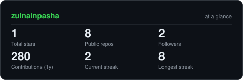
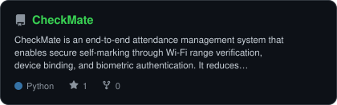
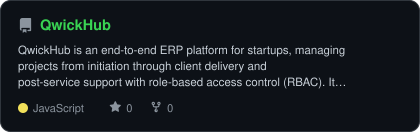
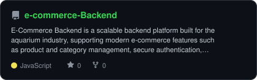
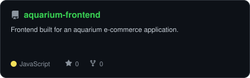

<div align="center">


<a href="https://www.linkedin.com/in/zulnainpasha1"></a>
<a href="mailto:zulnainpasha1@gmail.com"></a>
<a href="https://github.com/zulnainpasha"></a>


</div>

---

## `~/` whoami

```console
$ cat about.txt
```

Hi, I'm **Zulnain (Pasha)**. I'm a backend developer, currently building out backend systems and bridging with the frontend team on my projects.

- Currently building **[CheckMate](https://github.com/zulnainpasha/CheckMate)**
- Portfolio: **coming soon**
- Learning **something you're currently learning**
- Fun fact: **something about you**

<br>

<div align="center">

## `~/` toolbox


</div>

---

<div align="center">

## `~/` skill radar

<table>
<tr>
<td width="50%" align="center" valign="middle">

<picture>
<source media="(prefers-color-scheme: dark)"  srcset="assets/radar-dark.svg">
<source media="(prefers-color-scheme: light)" srcset="assets/radar-light.svg">

</picture>

</td>
<td width="50%" align="center" valign="middle">

<picture>
<source media="(prefers-color-scheme: dark)"  srcset="assets/radar-langs-dark.svg">
<source media="(prefers-color-scheme: light)" srcset="assets/radar-langs-light.svg">

</picture>

</td>
</tr>
</table>

</div>

---

<div align="center">

## `~/` contribution calendar


<br><br>

<picture>
<source media="(prefers-color-scheme: dark)"  srcset="https://raw.githubusercontent.com/zulnainpasha/zulnainpasha/output/snake-dark.svg">
<source media="(prefers-color-scheme: light)" srcset="https://raw.githubusercontent.com/zulnainpasha/zulnainpasha/output/snake.svg">

</picture>

</div>

---

<div align="center">

## `~/` the numbers

<picture>
<source media="(prefers-color-scheme: dark)"  srcset="assets/card-stats-dark.svg">
<source media="(prefers-color-scheme: light)" srcset="assets/card-stats-light.svg">

</picture>

<br>


<br><br>


</div>

---

<div align="center">

## `~/` selected work

<table>
<tr>
<td width="50%">
<a href="https://github.com/zulnainpasha/CheckMate">
<picture>
<source media="(prefers-color-scheme: dark)"  srcset="assets/card-CheckMate-dark.svg">
<source media="(prefers-color-scheme: light)" srcset="assets/card-CheckMate-light.svg">

</picture>
</a>
</td>
<td width="50%">
<a href="https://github.com/zulnainpasha/QwickHub">
<picture>
<source media="(prefers-color-scheme: dark)"  srcset="assets/card-QwickHub-dark.svg">
<source media="(prefers-color-scheme: light)" srcset="assets/card-QwickHub-light.svg">

</picture>
</a>
</td>
</tr>
<tr>
<td width="50%">
<a href="https://github.com/zulnainpasha/e-commerce-Backend">
<picture>
<source media="(prefers-color-scheme: dark)"  srcset="assets/card-e-commerce-Backend-dark.svg">
<source media="(prefers-color-scheme: light)" srcset="assets/card-e-commerce-Backend-light.svg">

</picture>
</a>
</td>
<td width="50%">
<a href="https://github.com/zulnainpasha/aquarium-frontend">
<picture>
<source media="(prefers-color-scheme: dark)"  srcset="assets/card-aquarium-frontend-dark.svg">
<source media="(prefers-color-scheme: light)" srcset="assets/card-aquarium-frontend-light.svg">

</picture>
</a>
</td>
</tr>
</table>

</div>

---

<div align="center">

<sub>`01110100 01101000 01100001 01101110 01101011 01110011 00100000 01100110 01101111 01110010 00100000 01110011 01100011 01110010 01101111 01101100 01101100 01101001 01101110 01100111`</sub>

</div>
